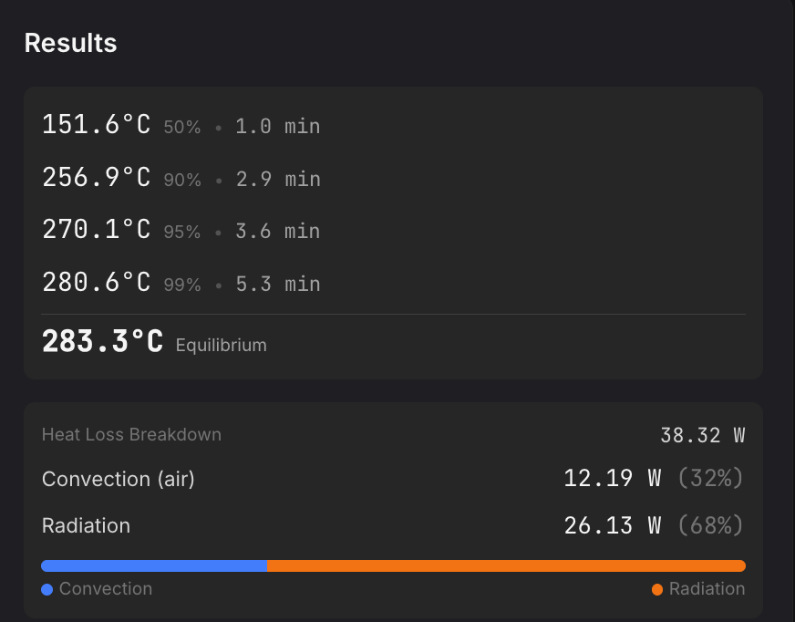
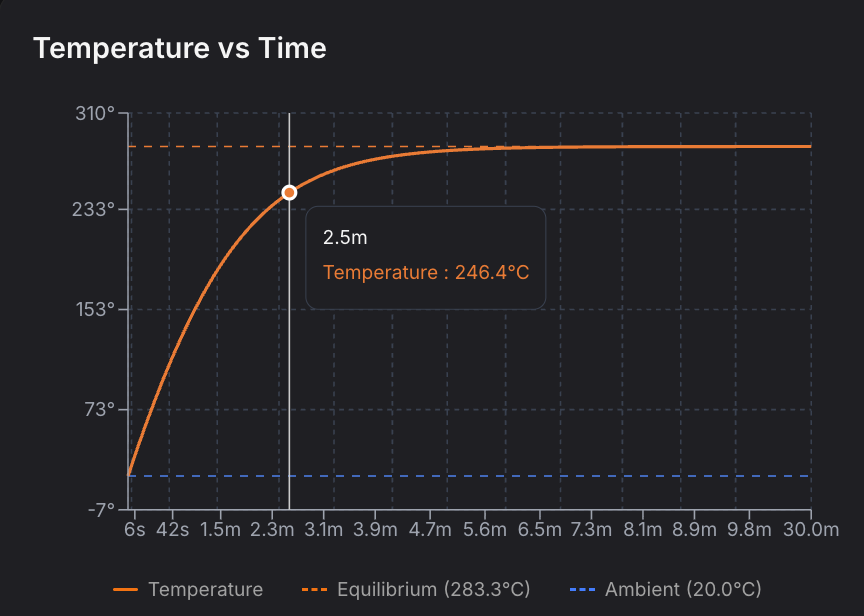
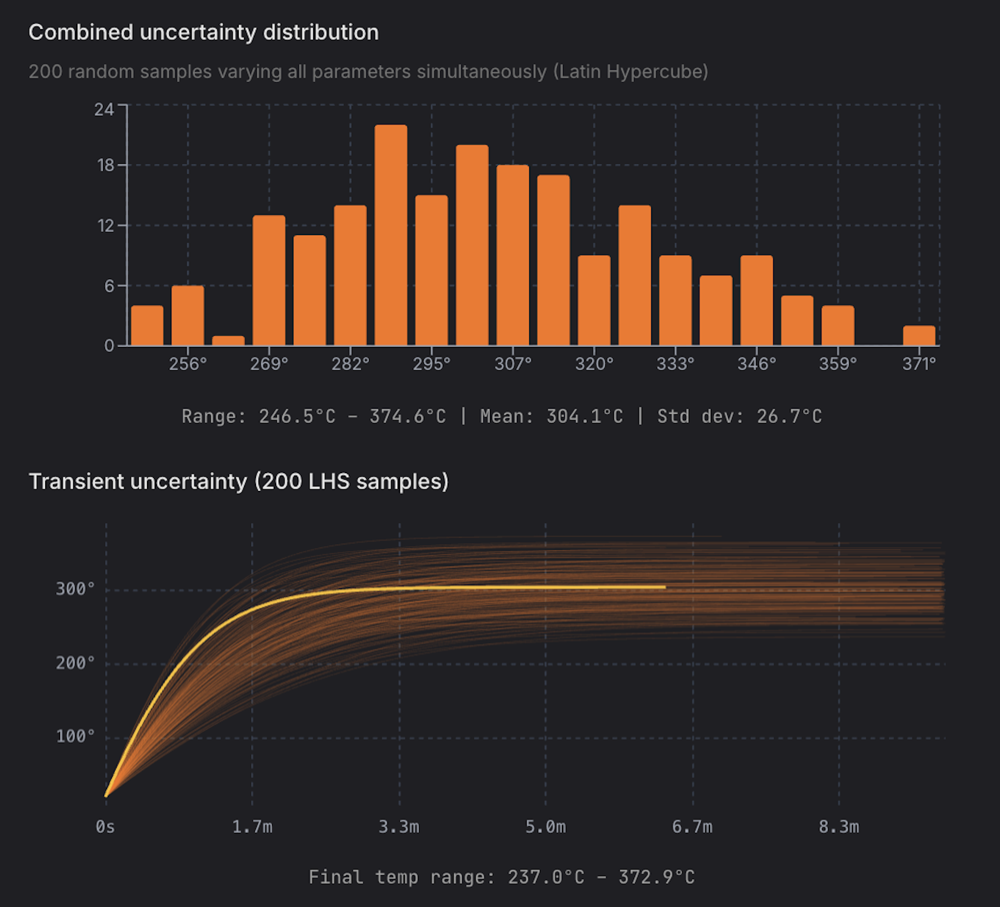

# Solar Heating Calculator

An interactive calculator that estimates how hot objects get under light exposure. Calculates equilibrium temperature, temperature-over-time curves, and heat loss breakdown.

**[Try it live](https://szerintedmi.github.io/solar-heating-calculator/)**

## Features

- **Three light input modes**: Direct irradiance (W/m²), lux conversion, lux with ND filter compensation
- **Presets for common materials**: Absorptivity, emissivity, heat capacity, convection conditions
- **Real-time results**: Equilibrium temperature, power balance, time to reach temperature milestones

<p align="center"></p>

- **Temperature vs time chart**: Visual curve showing heating progression

<p align="center"></p>

- **Sensitivity analysis**: Latin Hypercube Sampling to explore how parameter uncertainty affects results, with parameter sweep and distribution charts

<p align="center"></p>

- **Educational explanations**: Expandable sections explaining the physics and the formulas

## Quick Start

```bash
bun install
bun run dev
```

Open [http://localhost:5173](http://localhost:5173)

## Limitations

This is an **estimation tool**, not a precision simulator. Key simplifications:

- **Suspended in air** — No conduction to mounting surfaces; only convection and radiation modeled
- **Uniform temperature** — Entire object treated as single temperature (lumped model)
- **Cuboid geometry** — Object modeled as a box; cooling area calculated from illuminated area + thickness
- **Constant convection** — Heat transfer coefficient doesn't vary with temperature or orientation
- **No phase changes** — No melting, burning, or chemical reactions
- **Approximate lux conversion** — K factor (lux → W/m²) varies with spectrum; expect ±20–40% uncertainty

**Do not use for safety-critical decisions.**

## Tech Stack

Bun, Vite, React, TypeScript, Tailwind CSS, Recharts, Biome, Vitest

## License

[CC BY 4.0](https://creativecommons.org/licenses/by/4.0/)
